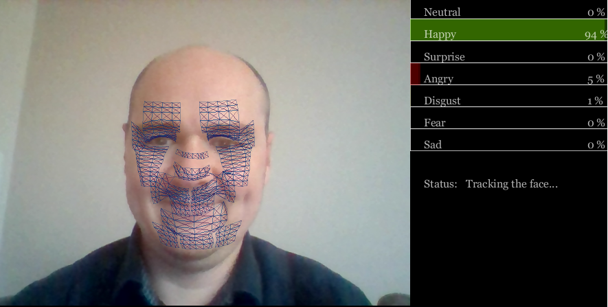

**Analysis: The theory of emotion that has been used to develop emotion recognition technologies is criticised as these technologies show low accuracy**

**By [Damien Dupré](https://damien-datasci-blog.netlify.app/), [Dublin City University Business School](https://business.dcu.ie/)**

A widespread application of machine learning algorithms, more commonly called Artifical Intelligence or AI, is to [track people’s identity](https://carnegieendowment.org/files/WP-Feldstein-AISurveillance_final.pdf). Just as identity can be recognised through the recording of faces, it is claimed that emotions can be recognised too. Emotion recognition algorithms are not applied for global surveillance yet. Since the development of the first commercial algorithm "Facereader" in 2005, they have been mainly focused on the validation of marketing content such as tv ads, product packaging or even food taste. With the multiplication of devices able to record peoples’ faces, and with the continuous improvements in the processing power of computers, emotion recognition technologies have found new real-life applications in the automotive industry and, more surprisingly, in job recruitment technologies. However, the performance of emotion recognition technologies based on facial expression have come under [close scrutiny by AI watchdog](https://ainowinstitute.org/AI_Now_2019_Report.pdf). In January 2021, [the company HireVue abandoned emotion recognition technologies as part of their AI recruitment assessment product](https://www.hirevue.com/blog/hiring/industry-leadership-new-audit-results-and-decision-on-visual-analysis). The reason for this decision may be related to the growth in research which is invalidating the assumptions about the link between facial expressions and emotions.

### The three principles of emotion recognition technologies

Since the 70’s, the most common paradigm in psychology about emotions stated three principles: (i) there is a direct relationship between an emotion felt and its facial expression, (ii) there are six basic emotions and each has a prototypical expression, and (iii) emotions and their expressions are universal. These assumptions were also conveyed in popular culture like in the Disney Pixar movie "Inside Out" released in 2015 or in the TV show "Lie to Me" (2009-2011) and were commonly accepted by companies and organisations. They were also ideal for the use of machine learning algorithms. Following this model, these algorithms claim to identify the emotion felt by someone, by categorising facial expressions as one of six basics emotions, and applying the algorithm to everyone without distinction of culture or origin. 

### Comparisons between human observers and algorithms

In addition to the hundreds of academic algorithms, [an exponential number of tech companies are providing commercial algorithms to infer emotions from facial expressions](https://ieeexplore.ieee.org/document/8480127) (Software, API or SDK). However, as shown in [the largest benchmark to date](https://doi.org/10.1371/journal.pone.0231968) led by DCU in collaboration with colleagues from Queen's University Belfast, University College London and University of Bremen, results from these technologies are significantly less accurate than human observers. In this study, eight commercially available algorithms were compared with human observers in the recognition of 937 videos supposedly expressing an emotion. There was considerable variance in recognition accuracy among the eight algorithms, and their classification accuracy was consistently lower than the observers’ accuracy. I have conducted another study which also revealed that the accuracy is [different according to the type of emotion as well](https://www.comtec.eecs.uni-kassel.de/emotionaware/EmotionAware2021_Program.pdf). These findings indicate potential shortcomings of existing algorithms for identifying emotions compared to human observers.

```{r echo=FALSE}

```

My emotion appears as "Happy" because I am smiling but this smile was not genuine.

### The problem of infering emotions from facial expressions

The accuracy of algorithms is not the main problem here; the fundamental principle of the relationship between emotions and facial expressions is called into question. Along with colleagues at the Université Grenoble-Alpes, [we have recorded 232 participants watching videos and collected their reported feelings while watching the video](https://doi.org/10.1007/s00426-020-01448-4). The recordings of their facial expressions were shown to human observers and were processed by a commercial algorithm designed by one of the leaders in the domain of emotion recognition technologies. The results revealed that the accuracy of the algorithm to identify the emotion felt from facial expressions was very low, as was the accuracy of human observers. In fact, it appears that there is [no scientific evidence showing a reliable correlation between the emotion felt and facial expressions](https://journals.sagepub.com/doi/10.1177/1529100619832930). This tends to indicate that all assumptions upon which emotion recognition technologies were built, are now invalid.

Despite these criticisms, there are some emerging solutions to the frailties in emotion recognition technologies. With the multiplication of devices available, recognition technologies will use not only the face, but also the entire body, and the context in which the expression is produced, to accurately infer emotions. Once these problems are solved, the definition of ethical and technological standards 
